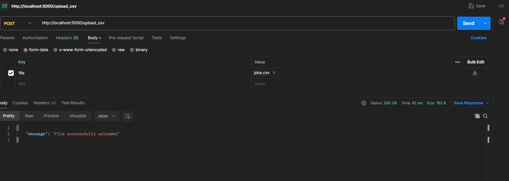
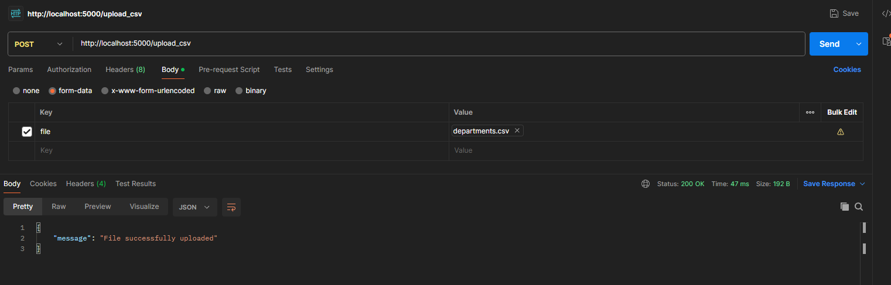
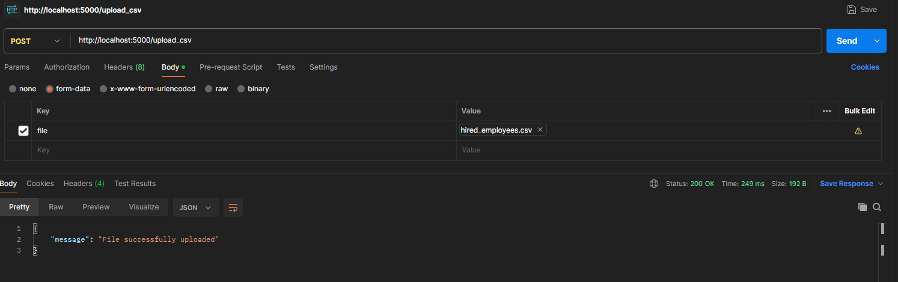
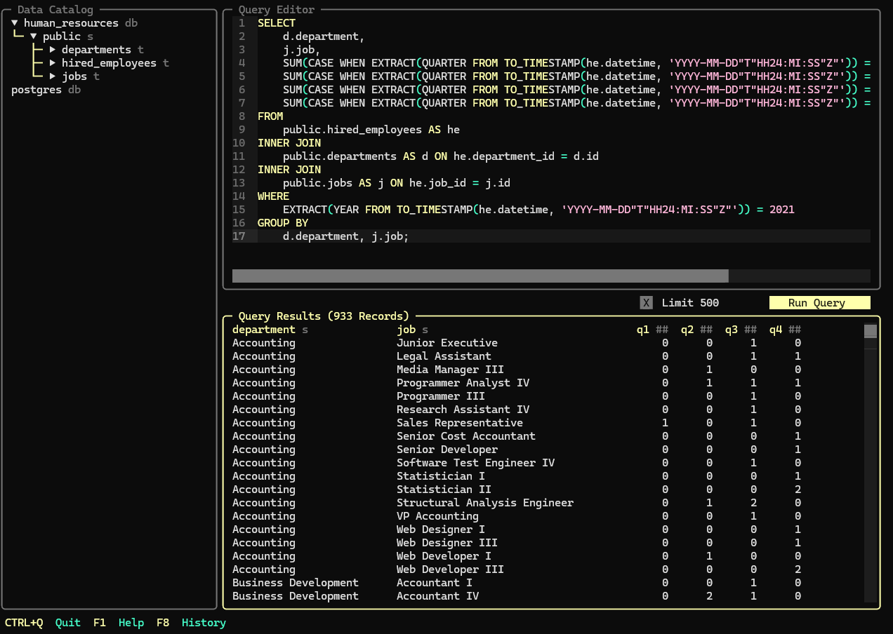
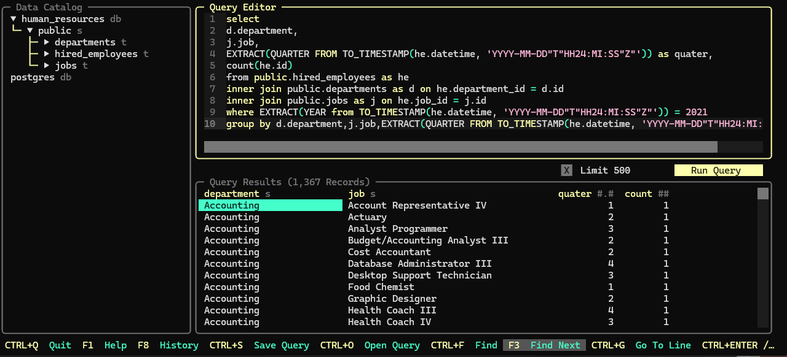

# Data Engineering test - Globant

The purpose of this repository is to show the solution to the test proposed by Globant for data engineering. 

The test consists of two steps:

1º Create an API, which receives the CSV files and inserts them into the respective tables in the Database.

2º Create two SQL files to apply the data model to the tables created. 

## API

For the api, I chose to use a Docker solution because it is cloud provider agnostic and can be run on Kubernetes. 

### the main points to note are:

- API with strong resource decoupling, which indicates that changes can be made to the database or API  processing independently.

- If there are new files, just create the SQL in the app/sql file, and the table will be created when the file is first invoked. 

### API tests using Postman

## SQL

A folder called reports\sql has been created where the .sql files are stored, making it easier to implement a streamlit, for example. 

## How to use

To use this application, just clone the repo and when you have docker and docker-compose installed, run the command below:

- docker-compose up --build

To access the tables created, you can use any IDE for accessing databases. I used the  solution, which allows me to have an IDE directly in the terminal. 

